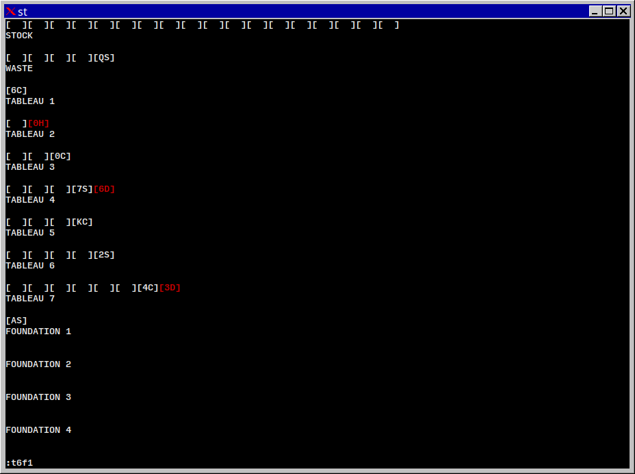

Solitaire (Klondike)
====================

This is a minimally-graphical Linux terminal version of the classic solitaire
card game Klondike (or "patience" in the UK), probably most widely known as
just "solitaire", and also well known for the version that has shipped with
Windows since 3.0. It is graphical to the extent that the positions of the
cards are indicated visually, but the cards themselves are just two-character
(rank and suit) representations.

The ranks, beginning with the ace, are as follows: A, 2, 3, 4, 5, 6, 7, 8, 9,
0, J, Q, K.  Note that the 10 is shown as a 0, in order to keep it to one
character.

Suits are: S, C, H, D. As a visual aid, diamond and heart cards are printed in
red.

Familiarity with the game's formal terminology is assumed, since this is used
to distinguish the card piles from one another, but in short, one draws cards
from the "stock", places them on the "waste", builds up seven piles in the
"tableau" with a descending sequence of ranks of alternating suit colors, and
ultimately builds up four "foundations" with ascending ranks of the same suit.
The piles, represented as a string of square-bracket-enclosed cards, are
properly labeled underneath.

Input takes the form of \<label\>\<label\>. The piles are labeled in the output as
w (waste); f1, f2, f3, f4 (foundations); t1, t2, t3, t4, t5, t6, t7 (tableau).
The first \<label\> refers to where the card you want to move currently is.  The
second \<label\> refers to where you want it to go.

The following are valid input. Angle brackets contain required input, square
brackets contain optional input, the bar symbol separates exclusive possible
inputs, and the pound sign is a number.

a) [#]<w|f#|t#>\<f#|t#\> The initial, optional number indicates how many cards
you would like to move at once and that the bottom card of that specified block
is the source card against which the above conditions are tested. If no number
is specified, the operation defaults to one. Only one card at a time can be
moved to a foundation pile.

b) \<d\> deals a single card from the stock to the waste.

c) \<ut#\> turns up a face down card on a tableau pile.
